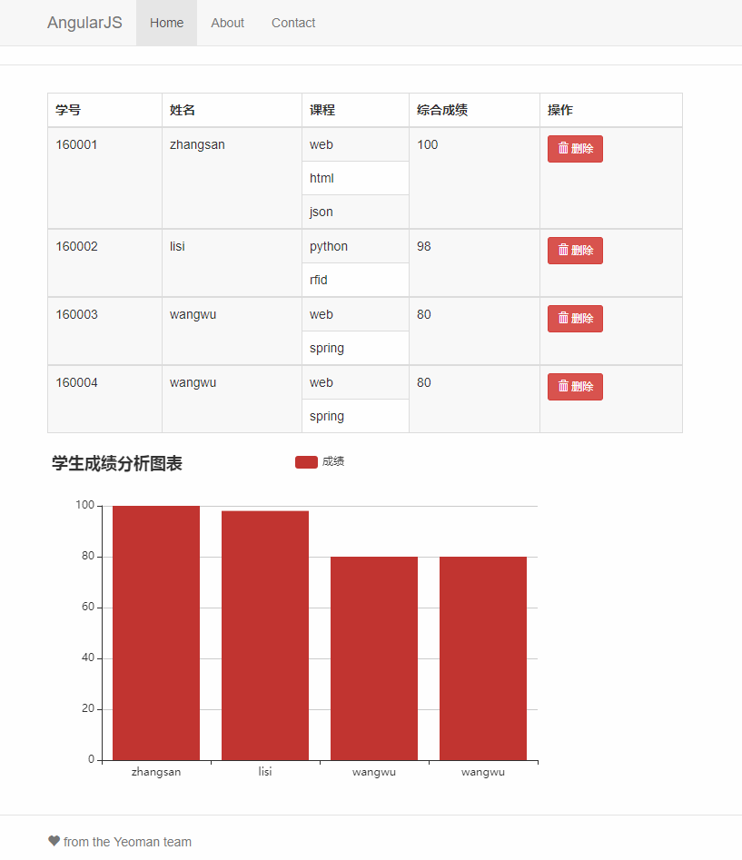

# 河北工业大学 可视化编程实验

## 实验一 `HTML`与`CSS`应用

利用`HTML`+`CSS`等相关知识设计并实现简单的`Web`页面。通过该实验，加深对`HTML`+`CSS`的理论知识的理解。

### 博客风格网页

### 跨行表格与动态柱状图

## 实验二 `JavaScript`实践

熟悉`JavaScript`语法，能够设计并实现一个使用`HTML`+`CSS`+`JavaScript`构建简单的`Web`页面。通过该实验，加深对`HTML`+`CSS`+`JavaScript`进行前端开发的理论知识的理解。
