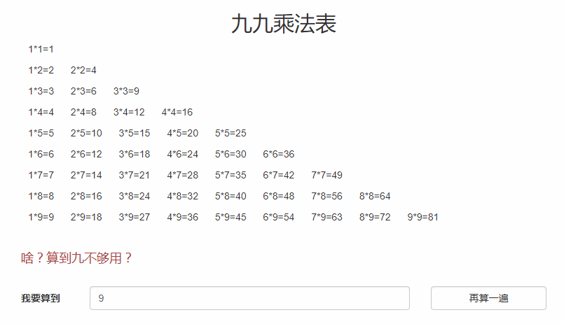
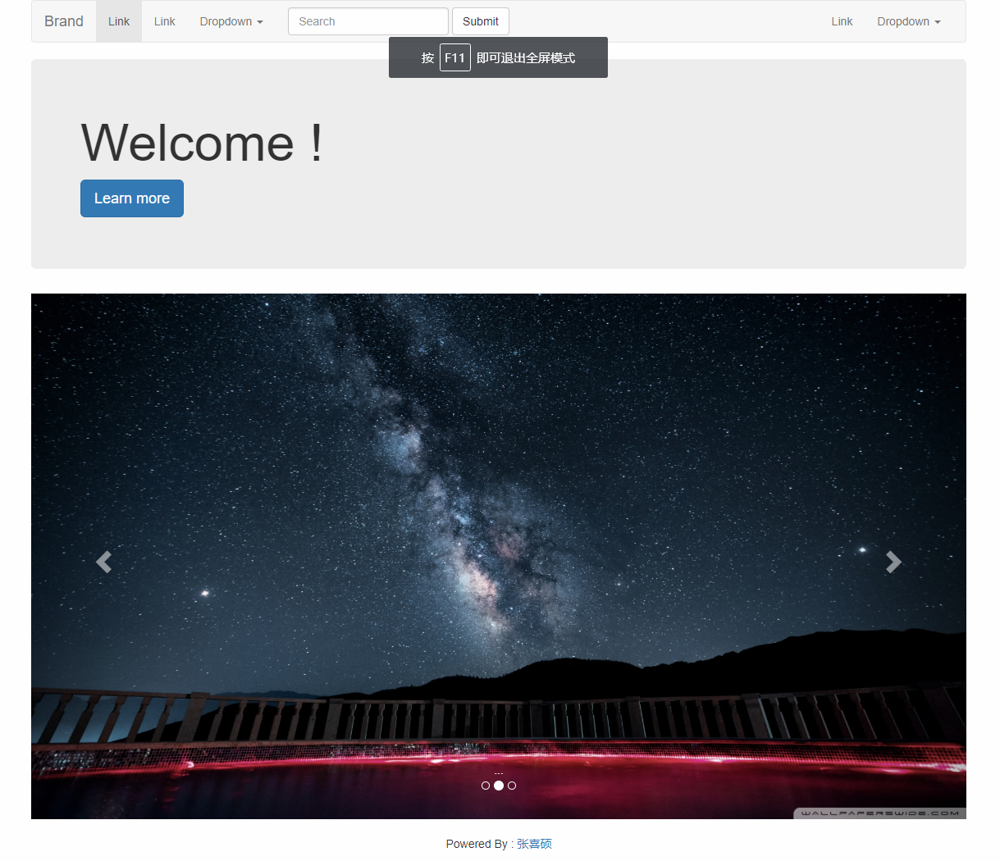

# 河北工业大学 可视化编程实验

## 实验一 `HTML`与`CSS`应用

利用`HTML`+`CSS`等相关知识设计并实现简单的`Web`页面。通过该实验，加深对`HTML`+`CSS`的理论知识的理解。

### 博客风格网页

### 跨行表格与动态柱状图

### 登录表单(对接后台)

### 申请表单

## 实验二 `JavaScript`实践

熟悉`JavaScript`语法，能够设计并实现一个使用`HTML`+`CSS`+`JavaScript`构建简单的`Web`页面。通过该实验，加深对`HTML`+`CSS`+`JavaScript`进行前端开发的理论知识的理解。

### 九九乘法表

### 找出符合条件的数

### 表单校验

### 显示选中项内容

### 简易网站

## 实验三 `Bootstrap`应用

熟悉`Bootstrap`等开源`HTML`+`CSS`+`JavaScript`前端开发框架。

### 大众点评

## 实验四 数据可视化分析

熟悉`D3.js`/`Echarts`等开源数据可视化工具，能够利用开源数据可视化工具进行简单的数据分析。

### 数据可视化分析

使用`Bootstrap`实现基本布局。

使用`AngularJS`来实现数据绑定。

使用`ECharts`实现数据可视化，同时图可在折线图、柱状图、散点图之间自由切换。

