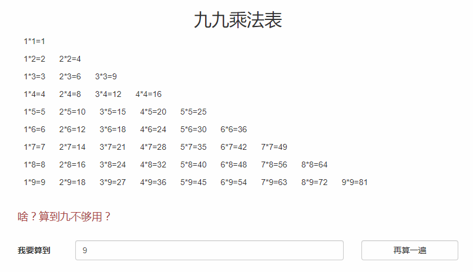
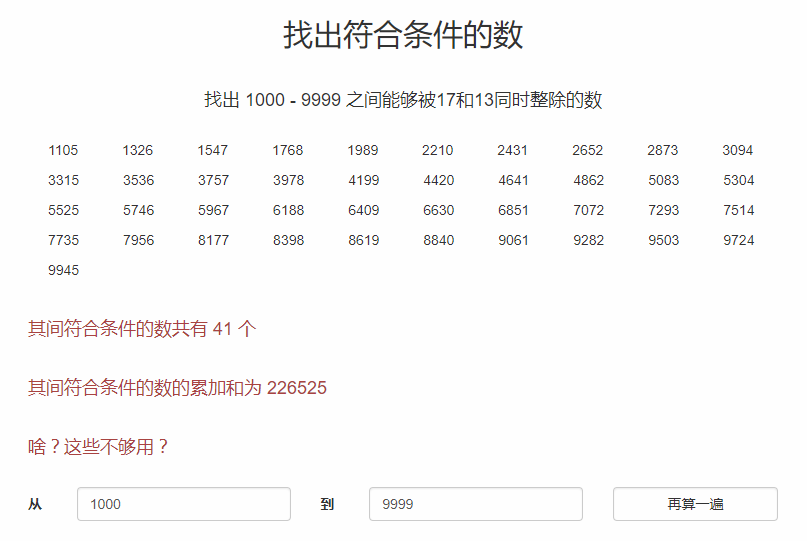

# 河北工业大学 可视化编程实验

## 实验二 `JavaScript`实践

熟悉`JavaScript`语法，能够设计并实现一个使用`HTML`+`CSS`+`JavaScript`构建简单的`Web`页面。通过该实验，加深对`HTML`+`CSS`+`JavaScript`进行前端开发的理论知识的理解。

### 九九乘法表

### 找出符合条件的数

### 表单校验

### 显示选中项内容

### 简易网站
